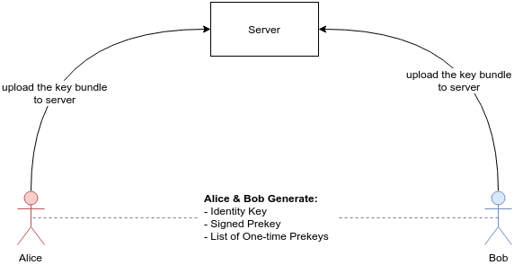
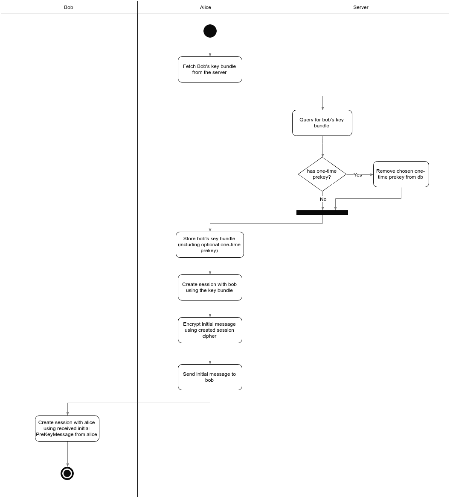

# signal protocol encryption

You have to generate three different keys:
- Identity key (long term, generated at install time)
- Signed prekey (medium term, update it once a week or month)
- Ephemeral prekeys (generate for example 100 key pairs)

these keys are key pairs consisting of public & private key, all public keys are
uploaded to server (identity key, signed prekey and ephemeral keys).

Keys:

- **Identity Key**
It's a long term key, generated at app install time, you can generate it using:
```
KeyHelper.generateIdentityKeyPair()
```
which returns object of type `IdentityKeyPair`, this object is actually just wrapper for
public and private key generated using `Curve25519` algorithm.

public and private key represented by `ECPublicKey` class and `ECPrivateKey` as private key, as these two keys can be wrapped inside `ECKeyPair` class.

- **Signed Prekey**
Medium term key, update this once a week or month, generate key using:
```
KeyHelper.generateSignedPreKey(IdentityKeyPair identityKeyPair, int signedPreKeyId)		// KeyHelper.java
```
It takes identity key pair as argument, this helper function has body:

```
// KeyHelper.java
public static SignedPreKeyRecord generateSignedPreKey(IdentityKeyPair identityKeyPair, int signedPreKeyId)
  throws InvalidKeyException
{
ECKeyPair keyPair   = Curve.generateKeyPair();
byte[]    signature = Curve.calculateSignature(identityKeyPair.getPrivateKey(), keyPair.getPublicKey().serialize());

return new SignedPreKeyRecord(signedPreKeyId, System.currentTimeMillis(), keyPair, signature);
}
```

First generate elliptic curve key pair as ussual, then sign the public key using identity private key,
After that wrap into single object including signed prekey id and timestamp.

- **Ephemeral Prekeys**
Last generate bunch of ephemeral prekey pairs, using:
```
KeyHelper.generatePreKeys(int start, int count)		// KeyHelper.java
```
start is the starting prekey id and count is how much to generate key pairs.

## Algorithms
- X3DH (Key Agreement Protocol also known as Key Exchange)
Stands for *eXtended Triple Diffie Hellman*, For example the X3DH protocol involves three parties: Alice, Bob, and a server. Alice wants to create a session and communicate with Bob.
It has three phases:
1. Bob publishes his Identity Key, Signed Prekey and Prekeys to server.
2. Alice fetches Bob's "prekey bundle" from the server and uses it to send initial message to Bob.
3. Bob receive and process Alice's initial message.

Explained in [x3dh.pdf](docs/x3dh.pdf)

[https://en.wikipedia.org/wiki/Diffie–Hellman_key_exchange](https://en.wikipedia.org/wiki/Diffie–Hellman_key_exchange)


- Double Ratchet Algorithm (Key Management Algorithm)

## Flow

Supose there are two parties Alice & Bob, each has logged in to app and generate each own key bundle and uploaded it to the server.



Now server has Alice's and Bob's key bundle to manage.

The scenario is: Alice wants to communicate with bob, in this case alice is the initiator.

